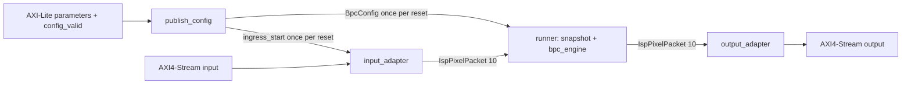

<!--
Project: Adaptive Directional BPC and BLC
Module: BPC Streaming HLS Contract
Description: Define the accepted non-algorithmic BPC architecture, boundaries, stream lifecycle, and implementation acceptance criteria.
Author: Viet Nguyen To Quoc
-->

# Contract kiến trúc HLS streaming BPC

Trạng thái: **đã chốt làm contract triển khai**, ngày 2026-09-28. Đây là hành vi yêu cầu; chưa phải kết quả implementation hoặc verification BPC streaming.

## 1. Phạm vi và authority

Tài liệu này sở hữu kiến trúc HLS ngoài thuật toán của BPC: wrapper/engine boundary, control, configuration, stream/frame lifecycle, storage advance, reset, backpressure và điều kiện nghiệm thu. Mục tiêu là tận dụng mô hình BLC hiện tại để triển khai BPC ở session tiếp theo.

- [bpc-adaptive-directional.md](bpc-adaptive-directional.md), mục 1–10, tiếp tục sở hữu thuật toán, arithmetic, CFA, tie-break và border behavior. Giữ `bpc_pixel()`, `BpcConfig`, `BpcWindow` hiện có trong `hls/bpc/isp_bpc.hpp/.cpp`.
- [blc_bpc_interface.md](blc_bpc_interface.md) sở hữu format dữ liệu chung và BLC boundary. Contract này cụ thể hóa standalone BPC.
- [ADR 0003](adr/0003-reuse-blc-boundaries-for-bpc.md) ghi lý do chọn mô hình này. [Proposal cũ](streaming_architecture_proposal.md) là căn cứ thiết kế, không tự động phê duyệt mọi chi tiết implementation trong đó.
- [verification-status.md](verification-status.md) sở hữu kết quả chạy thực tế. Kết quả BLC không được dùng làm bằng chứng BPC đã pass.

Phạm vi triển khai kế tiếp là BPC engine, standalone wrapper và verification tương ứng. TOP tích hợp toàn ISP, register map của TOP ghép, thay thuật toán, sửa BLC và các module của thành viên khác không thuộc phạm vi này. Việc chốt tài liệu chưa thực hiện thay đổi C++/RTL/test trong session hiện tại.

## 2. Các quyết định kiến trúc

| ID | Quyết định đã chốt | Tham khảo BLC |
|---|---|---|
| BPC-01 | Ba tầng: wrapper/runner, engine stream có state, hàm pixel | Có |
| BPC-02 | Standalone `bpc_top` dùng `ap_ctrl_none`, các process dùng `hls::task` và channel/task có lifetime `hls_thread_local` | Có |
| BPC-03 | AXI chỉ ở wrapper; engine trao đổi `IspPixelPacket<10>` | Có |
| BPC-04 | Wrapper công bố một config snapshot mỗi reset; runner nhận trước pixel và giữ đến reset | Có |
| BPC-05 | Frame liên tục, số lượng không biết trước; không `frame_count`, không start lại theo frame | Có |
| BPC-06 | SOF admission tại gốc frame; geometry cố định; output marker tạo từ tọa độ output | Có, nhưng BPC dùng tọa độ center output riêng |
| BPC-07 | Mỗi lần gọi BPC engine thực hiện tối đa một committed storage advance hoặc không advance | Không lấy nguyên bước read/process/write của BLC |
| BPC-08 | Tách input thật, storage advance, center generation và AXI retirement | BPC cần state riêng |
| BPC-09 | Bốn line-buffer bank, horizontal window, center delay, overlap và synthetic drain | BPC cần cơ chế riêng |
| BPC-10 | Bảo toàn center/data/metadata và output pending dưới backpressure; chỉ advance khi có khả năng giữ kết quả | Nguyên tắc chung; BPC cần triển khai riêng |
| BPC-11 | Pipeline hướng tới II=1 và có khả năng flush operation đã nhận | Tham khảo FLP của BLC; không thay thế window drain |
| BPC-12 | Nghiệm thu bằng independent reference và generated-RTL handshakes | Tham khảo phương pháp BLC, mở rộng traffic cho BPC |

## 3. Boundary và interface

| Tầng | Trách nhiệm |
|---|---|
| Wrapper `bpc_top` | AXI4-Stream adapters, AXI-Lite/DirectIO, config publication, ingress admission, task/channel instantiation và reset integration |
| Runner trong wrapper | Nhận config một lần, giữ snapshot local, gọi engine liên tục với snapshot đó; sở hữu scheduling scope của task |
| `bpc_engine` | Nhận packet, frame admission, counters, line buffers/window, real/synthetic arbitration, center ownership, border bypass, gọi `bpc_pixel`, phát packet output |
| `bpc_pixel` | Tính kết quả cho window và tọa độ center theo thuật toán đã có; không stream I/O hoặc protocol cấu hình |

Interface engine đích:

```cpp
void bpc_engine(
    hls::stream<IspPixelPacket<10>>& input,
    hls::stream<IspPixelPacket<10>>& output,
    const BpcConfig& config
);
```

`const BpcConfig&` là tham số từ runner vào helper trong cùng process; config qua boundary giữa các task bằng FIFO snapshot. Engine không nhận DirectIO, `config_valid`, AXI register address hoặc AXI packet. Phân tầng source không bắt buộc mỗi helper trở thành một module RTL riêng; không tạo transaction restart giữa runner và engine.



Standalone và tích hợp sau này sử dụng cùng engine. Khi ghép BLC→BPC, nối packet giữa các engine; wrapper tổng tiếp quản AXI/config. Quyết định register map hoặc commit chung của wrapper tổng thuộc lần tích hợp riêng.

## 4. Data, geometry và configuration

Input là RGGB RAW10 sau BLC. Một pixel nằm trong `TDATA[9:0]` của `ap_axiu<16,1,0,0>`; input hợp lệ có bit cao bằng 0, `keep=strb=0b11`. Adapter nội bộ giữ `data,user,last`; output adapter zero-extend dữ liệu và đặt `keep=strb=0b11`. Không thêm config hoặc AXI byte-enable vào từng packet nội bộ.

Geometry là compile-time, dùng chung `isp_frame.hpp`; production mặc định 1920×1080. Verification nhỏ dùng 16×16 và 16×12. Không thêm width/height runtime; các cấu hình kích thước khác cần kiểm bounds của counter và storage trước khi tuyên bố hỗ trợ.

Standalone wrapper ánh xạ năm field hiện có qua DirectIO sang AXI-Lite:

| Field `BpcConfig` | Độ rộng | Ý nghĩa trong contract thuật toán |
|---|---|---|
| `thresh_r`, `thresh_g`, `thresh_b` | Mỗi field 10 bit unsigned | `T0_R`, `T0_G`, `T0_B` |
| `shift_signal`, `shift_gradient` | Mỗi field 4 bit unsigned | `k_s`, `k_a` |
| `config_valid` của wrapper | 1 bit, reset 0 | Commit toàn bộ cấu hình |

Giá trị được cung cấp bởi caller, không hardcode operating point vào engine. Địa chỉ thanh ghi cụ thể được ghi nhận từ generated register map khi triển khai; không đoán offset từ BLC.

Giao thức khởi động:

1. Reset xóa trạng thái published/started/configured và control của engine.
2. Phần mềm ghi đủ năm tham số, đợi giao dịch ghi hoàn tất và bảo đảm thứ tự MMIO.
3. Phần mềm ghi `config_valid=1` sau cùng, giữ tất cả giá trị ổn định đến reset.
4. Publisher đọc và gửi đúng một `BpcConfig` snapshot cho runner, cùng một token mở ingress. Config channel và ingress token channel dùng depth 2 như BLC.
5. Runner phải nhận snapshot trước khi gọi engine. Ingress phải nhận token trước khi chủ động đọc input stream. Pixel đã được AXI interface buffer nhận sớm phải được giữ đúng thứ tự hoặc backpressure khi buffer đầy.
6. Sau đó stream chạy liên tục. Không reload config tại SOF; không đổi cấu hình giữa frame hoặc trong delayed tail. Muốn cấu hình lại phải reset.

`config_valid` không phải start/done theo frame. Tính đúng phải đến từ config dependency của runner, không từ thứ tự khai báo task, số cycle chờ hoặc dummy input.

## 5. Frame admission và các miền tiến độ

Nguồn cung cấp W×H pixel thật theo row-major cho mỗi frame; `user` là SOF, `last` là EOL, không có EOF riêng. Tại vị trí chờ `(0,0)`, packet không SOF bị đọc bỏ, không vào storage, không tăng số pixel thật và không tạo output. SOF được xử lý ngay như pixel đầu. Trong frame, SOF dư bị bỏ qua và input `last` không điều khiển counter. Contract không phục hồi frame bị mất/chèn pixel giữa frame.

Các sự kiện phải phân biệt rõ:

| Miền | Khi nào tiến | Ownership |
|---|---|---|
| AXI input acceptance | `TVALID && TREADY` ở input ngoài cùng | Wrapper/interface buffer; chưa nhất thiết đã vào window |
| Input frame `in_row/in_col` | Pixel thật được commit vào storage | Engine; prefetch vào pending slot chưa làm counter tiến |
| Storage `lb_addr` và window | Real hoặc synthetic advance được commit | Engine |
| Center generation `out_row/out_col` nội bộ | Center thật được tạo và có chỗ giữ output của nó | Engine/output pipeline; tọa độ gắn vào data/metadata |
| External output retirement | `TVALID && TREADY` ở AXI output | Egress/monitor; frame retire tại beat cuối |

Ghi vào FIFO output nội bộ không đồng nghĩa beat đã ra chân AXI. Engine không cần feedback AXI để ép center generation trùng retirement. FIFO/egress sở hữu packet đã nhận và phải giữ data/sideband ổn định, đúng thứ tự.

SOF không xóa storage, reset `lb_addr` hoặc khởi động lại một warmup cố định. Input và output frame counters có lifetime độc lập: engine có thể nhận frame mới khi còn tạo tail frame cũ.

## 6. Storage và committed advance

Giữ bốn bank độc lập có chiều dài W, `horizontal[3][5]` và computing window sparse same-CFA. Một committed advance thực hiện nhất quán:

1. Chọn đúng một token real hoặc synthetic và bảo đảm có chỗ giữ mọi kết quả phát sinh.
2. Đọc giá trị cũ ở bank address hiện tại, ghi token mới cùng history dịch xuống các bank.
3. Shift/load horizontal window; xác định center sau update và frame ownership tương ứng.
4. Với center thật, tạo đúng một output: border bypass hoặc gọi `bpc_pixel()` theo tọa độ center, rồi gắn SOF/EOL.
5. Commit các state liên quan đúng một lần. Input coordinates chỉ tiến cho real; `lb_addr` wrap modulo W cho cả real và synthetic; output coordinates chỉ tiến cho center thật đã có chỗ giữ.

Đây là thứ tự logic; HLS có thể pipeline qua nhiều clock. Phải giữ dependency, căn chỉnh data/ownership/metadata và bảo toàn operation khi stall. Không cập nhật storage rồi đánh mất center vì output chưa sẵn sàng. Nếu prefetch packet, phải có pending storage và không đọc đè packet chưa commit.

Delay của center là `D = 2*W + 2` committed advances, không phải latency clock cố định. Physical address không bị ép bằng logical column; synthetic giữa frame có thể làm chúng lệch nhau. Không có synthetic trong frame, nên hai pixel cùng cột ở các hàng liên tiếp của một frame vẫn cách nhau W advance.

Memory implementation phải cung cấp read-old/write-new cần thiết mỗi advance. Kiểm memory-port schedule và read/write ordering trong synthesis/RTL; không dùng `DEPENDENCE false` nếu chưa chứng minh dependency được bỏ là không có thật.

## 7. Arbitration, drain và center ownership

| Trạng thái input | Real input hợp lệ sẵn sàng ở engine | Không có real input hợp lệ |
|---|---|---|
| Đang trong frame | Advance real nếu đủ output capacity | Freeze storage; không synthetic |
| Giữa frame, còn center thật chưa expose | Ưu tiên SOF/real của frame mới | Advance synthetic zero nếu đủ output capacity |
| Giữa frame, không còn center thật cần expose | Nhận frame mới tại SOF | Idle, không advance |

Engine phải quyết định được khi không có input; không blocking-read vô điều kiện trước nhánh drain. Có thể dùng nonblocking read/availability tại FIFO packet nội bộ; AXI adapters giữ cơ chế blocking stream như BLC. Real đã có trong FIFO hoặc pending slot của engine phải được ưu tiên hơn synthetic. Packet bị bỏ vì thiếu SOF không được đưa vào window hoặc làm mất nghĩa vụ drain tail đang chờ.

Sau pixel thật cuối, tối đa D advance nữa expose các center còn lại. Những center tail này thuộc border và giữ nguyên giá trị center theo contract thuật toán. Frame kế tiếp có thể cung cấp các advance đó; nếu chưa có frame kế tiếp, engine tự dùng synthetic zero. Không yêu cầu nguồn gửi thêm pixel hoặc dummy frame.

**Quyết định center ownership:** Với `N = W*H > D`, frame input đủ `N` pixel và synthetic chỉ xuất hiện giữa các frame, không dùng bit valid cho từng pixel/token trong line buffer hoặc horizontal window, cũng không dùng valid-bit shift register. Engine xác định center thật bằng tiến độ input/output và `D`; đây là control của committed advance, không phải metadata lưu cùng pixel. Output coordinate *một mình* không đủ để phân biệt center synthetic.

Gọi `in_index = in_row*W + in_col` và `out_index = out_row*W + out_col` ở **trạng thái trước advance**; `real_advance` chỉ đúng khi pixel thật được commit (không phải chỉ được prefetch). Sau khi cập nhật window, center tại advance này là pixel thật khi `out_index != 0` **hoặc** `(real_advance && in_index >= D)`. Khi `out_index != 0`, output frame đang dở và mỗi advance kế tiếp expose center thật tiếp theo của frame đó. Khi `out_index == 0`, các advance warmup/synthetic bị bỏ qua; center đầu frame mới chỉ được expose lúc pixel thật có `in_index == D` được commit. Nếu không có committed advance, các chỉ số và window đứng yên; riêng AXI output stall vẫn có thể cho phép advance khi còn output capacity. `center_is_real` có thể là kết quả tổ hợp của điều kiện này, không phải state bit dịch theo dữ liệu.

Synthetic không tính là input ảnh và không tạo output. Dừng synthetic ngay khi không còn center thật cần expose, kể cả output cuối còn nằm trong FIFO do backpressure. Nếu đổi một trong các tiền đề `N > D`, frame đủ `N` pixel hoặc không có synthetic trong frame, phải xem lại cách xác định center trước khi thay contract; không tự thêm per-pixel valid bit vào thiết kế đã chốt.

Ví dụ chỉ số advance zero-based, W=16, H=16, N=256, D=34:

- F0 vào ở advance 0..255; center thật F0 được expose ở 34..289.
- Zero gap: F1 SOF ở 256, center đầu F1 ở 290, nối ngay sau center cuối F0.
- Chèn 5 synthetic ở 256..260 rồi nhận F1 tại 261: center cuối F0 ở 289 làm `out_index` về 0; ở 290..294, `in_index` của F1 mới là 29..33 nên center synthetic không phát; tại 295, `in_index=34=D` và center đầu F1 được expose.
- Không có F1: drain đến 289 rồi dừng. Stall clock không tăng chỉ số advance; latency BRAM/arithmetic pipeline được xét riêng.

## 8. Scheduling, backpressure và reset

Một lần gọi engine có tối đa một storage advance; task lặp liên tục. Khi real input và output capacity liên tục sẵn sàng, mục tiêu là một real pixel/cycle, II=1 và không có bubble nhận input do biên frame. Không thêm transaction restart theo frame.

Tham khảo `PIPELINE II=1 style=flp` của BLC ở ingress/runner/egress, kiểm scope và schedule thực tế. FLP hoàn thành operation đã có trong pipeline; synthetic drain đưa center còn trong line buffer ra vị trí tính toán. Hai cơ chế đều cần được kiểm riêng. Không tự đổi sang finite `ap_ctrl_hs + frame_count` để né vấn đề tool.

Khi downstream stall, pending output phải giữ nguyên. Operation đã nhận vẫn được phép tiến trong pipeline nếu còn capacity; không yêu cầu mọi register đứng yên ngay khi AXI `TREADY=0`. FIFO pixel có độ sâu hữu hạn được khai báo/ghi nhận rõ khi triển khai; không coi depth của BLC là bằng chứng đủ cho BPC.

Reset xóa config flags, frame/counter state và output pending state. Không bắt buộc clear toàn bộ line-buffer RAM; center ownership control phải ngăn history cũ/chưa khởi tạo trở thành output thật. Reset giữa frame hủy frame đang dở và mọi beat in-flight cũ. Sau reset phải cấu hình lại và bắt đầu frame mới tại SOF. Wrapper standalone dùng cùng clock/reset domain cho control và datapath; CDC mới nằm ngoài phạm vi.

## 9. Tiêu chí nghiệm thu

Đây là kế hoạch kiểm chứng, chưa có mục nào được đánh dấu pass cho BPC streaming mới.

| Gate | Bằng chứng cần có |
|---|---|
| G1 — Config/interface | Synthesis nhận standalone `ap_ctrl_none`, AXI ports và config fields đúng; reset `config_valid=0`; snapshot và ingress dependency đúng; không xử lý pixel bằng config chưa publish |
| G2 — Storage/control trace | Trace đánh số token chứng minh read-old/write-new, D, center ownership theo input/output counters, tọa độ, synthetic suppression và overlap; khớp các ví dụ mục 7 |
| G3 — Functional CSim | So mọi output data/sideband với reference độc lập theo từng frame; 16×16 và 16×12; nguồn dừng đúng sau N pixel thật, không dummy/preamble cần cho đồng bộ |
| G4 — Generated RTL | Lặp các traffic dưới đây trên RTL sinh ra, scoreboard theo accepted beats, kiểm exact count và output stability khi stall; nguồn đúng protocol AXI-Lite |
| G5 — Synthesis và production geometry | Kiểm achieved II, memory ports/dependencies, finite buffer depths và warnings; chạy kiểm tra functional/RTL phù hợp ở 1920×1080 trước khi tuyên bố hỗ trợ production geometry đã được xác minh |

Traffic bắt buộc trên generated RTL ở G4: một frame rồi ngừng hẳn; hai frame zero gap; short gap; frame mới đến sát drain completion; gap dài hơn drain; in-frame input stall; output backpressure; synthetic tới center; nhiều frame có gap trộn; SOF đến trước config commit; reset khi còn operation/output in-flight rồi cấu hình lại và gửi SOF mới. Kiểm policy bỏ packet trước SOF, bỏ qua SOF dư và input EOL theo mục 5. G3 đối chiếu dữ liệu/sideband và các trace real/synthetic mà C model điều khiển được; kết quả CSim không thay thế kiểm tra clock, AXI ordering, stall hoặc hardware reset ở G4.

Sau drain và khi sink cho phép tiến: số output thật bằng số input đã được nhận vào frame, mỗi frame hoàn chỉnh có N output đúng thứ tự. Với input hợp lệ không có packet bị bỏ, tổng AXI input beats bằng tổng AXI output beats. Reset hủy transaction cũ phải mở epoch scoreboard mới.

Zero-gap case phải đo handshake cuối frame và đầu frame tiếp theo tại input/output, sau warmup và khi sink luôn ready; không dùng riêng báo cáo II làm bằng chứng. Test phải tự hoàn tất sau beat cuối, có watchdog để phát hiện deadlock.

Golden giữ độc lập với HLS DUT; không dùng `bpc_pixel()` HLS làm oracle cho chính nó. Nếu reference chưa hỗ trợ geometry nhỏ, chuẩn bị thay đổi reference riêng có đối chiếu đường mặc định trước khi dùng làm golden. Harness CoSim phải ghi đủ tham số rồi commit; nếu tool sinh writer song song như BLC, sửa ordering của harness một cách kiểm soát và ghi rõ, không sửa DUT/golden để làm pass.

Ghi revision/hash, tool/version, config, command và kết quả vào `verification-status.md`; raw artifacts để trong ignored `build/`. Mốc tham khảo từ BLC là Vitis/Vivado 2026.1, `xczu7ev-ffvc1156-2-e`, constraint 150 MHz. Synthesis estimate không phải timing sau place-and-route; standalone pass không phải bằng chứng TOP ISP pass.

## 10. Handoff cho session triển khai

Đọc file này, thuật toán hiện hành và `hls/blc/none/isp_blc.*`, `hls/blc/none/blc_top.*` trước khi sửa. Thực hiện theo G1→G5, giữ source changes theo từng milestone có thể kiểm riêng. Không khám phá lại control/config boundary đã chốt chỉ vì BPC có state nhiều hơn BLC.

Chi tiết được phép chọn trong implementation: encoding FSM, tên helper, width counter đủ bounds, cách biểu diễn center ownership control ở mục 7 và output capacity phù hợp. Contract không buộc một kiểu FSM hay tách window thành task riêng; quyết định không dùng per-pixel valid bit đã chốt ở mục 7. Mọi lựa chọn phải thỏa committed-advance và acceptance criteria; lưu rationale khi có hệ quả kiến trúc đáng kể.

Nếu cần đổi thuật toán, lifetime config, số frame, chính sách SOF/reset, storage geometry, drain/overlap hoặc thêm external interface, phải đưa thay đổi contract cho Việt quyết định trước. Session triển khai cần yêu cầu thực hiện cụ thể từ Việt; tài liệu này là baseline đã chốt để bắt đầu từ đó.
