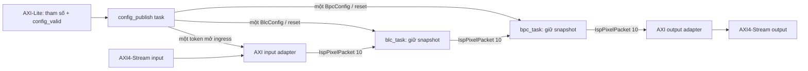

<!--
Project: Adaptive Directional BPC and BLC
Module: Streaming Architecture Proposal
Description: Propose a stable control, configuration, engine, and verification boundary for the streaming BLC and BPC rebuild.
Author: Viet Nguyen To Quoc
-->

# Proposal kiến trúc streaming BLC/BPC và boundary khi ghép ISP

**Trạng thái: đề xuất để Việt đọc và duyệt; chưa phải implementation đã kiểm chứng.**

Cập nhật authority 2026-09-28: phần kiến trúc BPC ngoài thuật toán đã được chốt tại [BPC streaming contract](bpc_streaming_contract.md), với rationale ở [ADR 0003](adr/0003-reuse-blc-boundaries-for-bpc.md). BLC hiện hành theo [interface contract](blc_bpc_interface.md). Nội dung khảo sát bên dưới được giữ như proposal lịch sử; các chi tiết như hai descriptor hoặc kiến trúc TOP toàn ISP không tự trở thành quyết định đã duyệt.

Ngày khảo sát: 2026-09-27. Source nhóm: `main` tại `f02cdcaf476555ecb5919bd05bb5f4feeb639c9c`. Baseline BLC rebuild: `work/bpc-streaming-rebuild` tại `401d2902e12342cb365fb0c1619ba2325ff87f2c`. Tool đích: Vitis HLS 2026.1, Vivado IP flow. Hai revision này khác nhau: BLC rebuild chưa nằm trên `main`.

Tài liệu này sở hữu **phương án control/config/boundary đang đề xuất**, không thay thế thuật toán hay tự sửa contract đã chốt. Sau khi được duyệt, phần quyết định được chuyển vào contract hiện hành trên branch rebuild; proposal được giữ làm căn cứ. Trong lượt khảo sát này chỉ đọc source, header, đoạn testbench liên quan và hướng dẫn AMD; không chạy CSim/CoSim, không sửa C++ và không đọc report/waveform nặng.

## 1. Quyết định đề xuất

**Giữ `ap_ctrl_none` cho standalone BLC mới và subsystem streaming BLC→BPC. Dùng `hls::task` cho các process chạy liên tục; wrapper sở hữu AXI, DirectIO và khởi động config; engine nhận stream packet cùng `const Config&`.**

Không đưa `frame_count` vào production interface. Không yêu cầu phần mềm start lại từng frame. Không đổi BLC thành API pixel-in/pixel-out chỉ để giải quyết config. Không thay toán BLC/BPC.

Config được ghi một lần sau reset và giữ nguyên đến reset tiếp theo. Đề xuất thêm **`config_valid` ở wrapper** để công bố rằng toàn bộ thanh ghi đã ghi xong. Wrapper truyền một snapshot config qua kênh riêng đến process chứa engine; process này nhận snapshot trước khi gọi engine. Như vậy thứ tự khởi động có phụ thuộc dữ liệu thực sự, không dựa vào số pixel chờ hoặc vị trí khai báo task.

Đây là một phương án duy nhất được đề xuất cho BLC/BPC. Các lựa chọn `hs`, mixed control và stable scalar được phân tích để giải thích quyết định, không phải các hướng sẽ tự động chuyển qua nếu một test thất bại.

**Giới hạn quyết định:** proposal không tự quyết định thay kiến trúc của Anh, Hoang, Nhan. TOP toàn ISP chỉ được gọi là streaming liên tục, không bubble ở biên, khi các tầng còn lại cũng đáp ứng contract đó. Hiện source nhóm chưa chứng minh điều này.

## 2. Căn cứ và sửa lại các kết luận trước

### 2.1. Ràng buộc đã tồn tại

Contract gốc `BPC_streaming_final_architecture_contract.md` trong Downloads yêu cầu stream vô hạn về số frame, không biết trước `frame_count`, overlap frame tail với frame tiếp theo, synthetic chỉ giữa frame, không reset line buffer tại SOF. Các điểm này đã được đưa vào mục 11 của `Viet/docs/bpc-adaptive-directional.md` trên revision rebuild `401d290`.

Contract BLC tại cùng revision yêu cầu: đợi SOF ở tọa độ `(0,0)`, đếm độc lập với sideband, bỏ qua SOF dư trong frame, tái tạo SOF/EOL, config không đổi trong lần chạy. Vì vậy lời khuyên chuyển production sang `hs + frame_count` chỉ vì code nhóm đang hữu hạn là **không phù hợp contract này**.

`ap_ctrl_hs` không đồng nghĩa chỉ xử lý được một frame. Nó có thể điều khiển một transaction dài chứa nhiều frame. Tuy nhiên, đó không phải lý do để thêm số frame phải biết trước vào thiết kế đã chốt streaming. `ap_ctrl_none` cũng không tự bảo đảm II=1, config đúng hoặc không mất output cuối.

### 2.2. Hai lỗi cũ phải được phân biệt

| Hiện tượng | Cơ chế cần xem | Điều không được kết luận quá mức |
|---|---|---|
| Output giống input dù black level khác 0 | Config thực sự được đọc/chốt lúc nào; thanh ghi đã có giá trị chưa | Không thể quy toàn bộ lỗi cho `ap_ctrl_none` |
| N input nhưng N−1 output khi nguồn ngừng | Pipeline có flush được không; task/scheduling có phụ thuộc vào input kế tiếp không | Không thể quy lỗi cho blocking `read()` nói chung |
| CoSim không kết thúc | Số beat mong đợi, traffic driver, completion model, non-blocking control, DUT deadlock | Không thể suy từ treo sang kết luận chỉ thiếu RAM hoặc chỉ sai DUT |

Source baseline hiện có `PIPELINE II=1 style=flp` ở BLC engine và `config_loaded` chốt config ở SOF đầu tiên. Test baseline chèn 64 packet không SOF trước dữ liệu. Kết quả 512/512 của lần chạy trước là bằng chứng lịch sử cho baseline và traffic đó; proposal này **không chạy lại** và không dùng kết quả ấy để chứng minh kiến trúc config mới.

Preamble 64 pixel tạo thời gian cho config, nhưng không phải giao thức đồng bộ. Một bus ghi chậm hơn có thể vượt khoảng chờ này. Đây là lý do cụ thể cần thay cơ chế khởi động, không phải lý do đổi control protocol.

## 3. AMD/Vitis nói gì, và ta suy ra gì?

Các liên kết sau là nguồn chính thức. Những lựa chọn cụ thể của dự án trong các mục sau là đề xuất kỹ thuật, không phải tuyên bố AMD đã kiểm chứng thiết kế của ta.

| Căn cứ AMD | Kết luận dùng trong proposal |
|---|---|
| [Block-Level Control Protocols](https://docs.amd.com/r/en-US/ug1399-vitis-hls/Block-Level-Control-Protocols) | Data-driven TLP dùng `ap_ctrl_none`; control của block khác handshake của từng port. |
| [Tasks and Channels](https://docs.amd.com/r/en-US/ug1399-vitis-hls/Tasks-and-Channels) | `hls::task` lặp task body liên tục; task và channel cần lifetime `hls_thread_local`. Thứ tự khai báo task không phải thứ tự chạy. |
| [Support of Scalars/Memory Interfaces in DTLP](https://docs.amd.com/r/en-US/ug1399-vitis-hls/Support-of-Scalars/Memory-Interfaces-in-DTLP) | Scalar stable và DirectIO có semantics khác nhau. Giá trị thay đổi sau khởi động không nên bị mô hình hóa thành scalar đã stable từ đầu. |
| [Mapping Direct I/O Streams to SAXI Lite Interface](https://docs.amd.com/r/en-US/ug1399-vitis-hls/Mapping-Direct-I/O-Streams-to-SAXI-Lite-Interface) | AMD có ví dụ DirectIO `hls::ap_none<T>` ánh xạ AXI-Lite và dùng trong task. Không được khẳng định chung rằng task/none không thể có config AXI-Lite. |
| [Flushing Pipelines and Pipeline Types](https://docs.amd.com/r/en-US/ug1399-vitis-hls/Flushing-Pipelines-and-Pipeline-Types) | Pipeline stalling có thể giữ kết quả cũ khi thiếu input mới. FLP cho phép phần đã nhận tiếp tục ra output. |
| [HLS Fence Library](https://docs.amd.com/r/en-US/ug1399-vitis-hls/HLS-Fence-Library) | Các truy cập độc lập có thể được reorder; fence ràng buộc thứ tự trong một scheduling region, không phải barrier toàn mạng DATAFLOW. |
| [Co-simulation Requirements](https://docs.amd.com/r/en-US/ug1399-vitis-hls/Co-simulation-Requirements-for-Interface-Synthesis) và [Non-Blocking API](https://docs.amd.com/r/en-US/ug1399-vitis-hls/Non-Blocking-API) | `none` có non-blocking stream không được bảo đảm CoSim tự kết thúc; phải có kế hoạch RTL verification riêng cho trường hợp này. |
| [Mixing Data-Driven and Control-Driven Models](https://docs.amd.com/r/en-US/ug1399-vitis-hls/Mixing-Data-Driven-and-Control-Driven-Models) | Hai mô hình có thể cùng tồn tại trong hierarchy phù hợp. Không suy rằng chỉ cần đổi pragma ở TOP thì mọi worker hữu hạn trở thành streaming không bubble. |

**Một điểm tài liệu chưa nhất quán cần công khai:** trang CoSim Requirements còn ghi quy tắc tổng quát rằng có `s_axilite` thì return cũng phải `s_axilite`; trong khi trang DirectIO mô tả đường task + AXI-Lite mới. Baseline local của ta đã có kết quả lịch sử với DirectIO + `none`, nhưng không thể dùng nó để bỏ qua mọi hạn chế của CoSim. Bản config mới phải qua gate Vitis 2026.1 nhỏ trước khi triển khai rộng. Nếu compiler/CoSim phản đối cấu trúc này, ghi nguyên nhân chính xác; không tự đổi production sang `hs`.

Trong lần khảo sát này cũng xác nhận bộ cài local có `hls_task.h`, `hls_directio.h`, `hls_fence.h`. Việc có header không chứng minh một tổ hợp scheduling sẽ đạt II hay pass CoSim.

## 4. Đọc code nhóm: điều học được và giới hạn

### 4.1. Nhân

- [WB standalone](../../Nhan/WB/TEST/isp_wb.cpp): một pixel mỗi invocation, `ap_ctrl_none`, gain qua `ap_none`, latch tại SOF. Wrapper phải bảo đảm config sẵn sàng. SOF reset tọa độ; EOL điều khiển sang hàng.
- [CCM standalone](../../Nhan/CCM/TEST/isp_ccm.cpp): tương tự, latch ma trận tại SOF. Comment nói none không thể sở hữu AXI-Lite không nên dùng làm quy tắc chung cho DirectIO của Vitis mới.
- [Demosaic standalone](../../Nhan/Demosaic/TEST/isp_demosaic.cpp): chỉ tiến bước khi đọc được input. [Test](../../Nhan/Demosaic/TEST/tb_demosaic_standalone_compare.cpp) đưa thêm `DELAY + RTL_MARGIN` input rồi chỉ kiểm các output ảnh thật đầu tiên. Đây không phải bằng chứng rằng DUT tự drain khi nguồn dừng sau đúng pixel cuối.
- [TOP ba block](../../Nhan/TOP/isp_3blocks_dataflow_top.cpp): AXI-Lite ở TOP; core nhận packet và tham số; tổng số beat hữu hạn theo `frame_count`. [Demosaic core](../../Nhan/TOP/isp_demosaic_core.cpp) tự tạo padding sau batch.

**Học:** tách adapter/core rõ, chốt config đúng trách nhiệm, chủ động mô hình hóa tail. **Không sao chép:** `frame_count` vào production BLC/BPC; dummy input từ testbench làm giải pháp xả DUT; reset tọa độ theo SOF/EOL thay contract của Việt.

### 4.2. Anh

- [Gamma](../../Anh/Gamma/isp_gamma.cpp) có cả phiên bản hữu hạn và `ver2` dùng `hls::task` một pixel. `ver2` dùng LUT trong thiết kế, không có cuộc đua bốn thanh ghi black level như BLC.
- [TOP LTM→Gamma](../../Anh/top/isp_ltm_gamma.cpp) hiện gọi bản Gamma hữu hạn. Các adapter xử lý đúng một frame mỗi invocation.
- [LTM](../../Anh/LTM/isp_ltm.cpp) có bước xử lý thêm sau input thật để hoàn thành cửa sổ; output marker được tạo từ tọa độ output.
- [Header](../../Anh/ltm_gamma.hpp) hardcode `100×100`. [Test TOP](../../Anh/top/tb_isp_ltm_gamma.cpp) còn truyền LUT vào hàm hiện chỉ khai báo hai stream: chưa đồng bộ API.
- Adapter AXI output chưa gán `keep/strb`; hàm LTM/Gamma được ghép vẫn chứa pragma interface của standalone.

**Học:** worker một pixel cho tầng không có cửa sổ, và tách hoàn thành cửa sổ khỏi input thật. **Không suy:** bật `VER2` đồng nghĩa TOP tổng đã chuyển sang none, hoặc mọi phiên bản test/source đang khớp nhau.

### 4.3. Hoang

- [TOP CNN](../../Hoang/isp_cnn_denoise_common.cpp) và [header](../../Hoang/isp_cnn_denoise.h) có đường AXI standalone và đường packet nội bộ. Các tầng vẫn hữu hạn theo một frame.
- Window stages có xử lý cạnh phải/hàng cuối riêng. Body/tail có fork/join và FIFO skip lớn; đây là bài toán cân bằng đường đi, không thể thay mọi FIFO thành depth=2.
- [Test TOP](../../Hoang/tb_local_resnet_micro.cpp) nạp hai frame nhưng gọi TOP hai lần. Không dùng điều đó làm chứng minh zero-gap handshake.
- `IspPixelPacket` được định nghĩa lại trong header; có thể xung đột khi include cùng packet chung. Adapter AXI output chưa gán `keep/strb`.
- RAW bị clamp ở 959 trước/sau mạng. Đây là contract miền giá trị cần trao đổi khi BLC có black level cấu hình được.
- TOP hiện gọi hai residual block; hai block còn lại được comment. Phải thống nhất biến thể mạng định ghép, không suy từ danh sách hàm rằng cả bốn đang chạy.
- `II=1` ở vòng MAC nhóm không phải một RAW pixel/cycle trực tiếp: vòng đọc một feature window mỗi bốn nhóm; một vị trí packed tương ứng ô Bayer 2×2. Phải quy đổi tốc độ theo RAW pixel và tính cả fill/drain, không kết luận CNN chậm bốn lần chỉ từ vòng nhóm.

**Học:** phân biệt giao diện tích hợp với standalone, tail hữu hạn rõ ràng và FIFO cho các đường lệch latency. **Không sao chép:** kích thước/FIFO/clamp vào BLC/BPC mà chưa có căn cứ riêng.

## 5. Kiến trúc được đề xuất

### 5.1. Ba lớp trách nhiệm

| Lớp | Sở hữu | Không đưa xuống lớp này |
|---|---|---|
| Wrapper/TOP | AXI adapters, AXI-Lite, DirectIO, config publication, task instantiation, reset integration | Toán BLC/BPC |
| Engine | Nhận/phát packet nội bộ, tọa độ, trạng thái frame; BPC thêm cửa sổ/drain | Địa chỉ AXI-Lite, `config_valid`, DirectIO |
| Pixel algorithm | BLC subtraction/clamp; BPC prediction/threshold/tie order | Stream I/O, frame start/stop, hardware register protocol |

Wrapper có thể gồm các hàm `static` trong file TOP. Tên file không bắt buộc mỗi process phải thành một module mới. `blc_engine` vẫn là worker stream; ranh giới trách nhiệm không bắt buộc tạo thêm hierarchy RTL.

### 5.2. Sơ đồ process và config



`blc_task` gọi `blc_engine(input, output, active_config)` như một hàm thông thường trong cùng process. `bpc_task` làm tương tự. Các task không chia sẻ một struct local ở TOP rồi giả định struct ấy tự trở thành thanh ghi chung. Mỗi task có snapshot local của chính nó; config channel có đúng một writer và một reader.

Standalone BLC là cùng cấu trúc bỏ phần BPC; không đổi engine thành một bản thuật toán riêng cho test. Khi ghép BLC→BPC, nối core packet trực tiếp, không gọi standalone `blc_top` rồi chuyển AXI qua lại giữa hai core.

### 5.3. Interface engine giữ nguyên ý nghĩa đã chốt

Đây là chữ ký đề xuất, không phải code đã áp dụng:

```cpp
void blc_engine(
    hls::stream<IspPixelPacket<10>>& input,
    hls::stream<IspPixelPacket<10>>& output,
    const BlcConfig& config
);

void bpc_engine(
    hls::stream<IspPixelPacket<10>>& input,
    hls::stream<IspPixelPacket<10>>& output,
    const BpcConfig& config
);
```

`const Config&` đi từ wrapper task vào helper cùng scheduling scope, không phải một scalar argument đi qua ranh giới `hls::task`. Đề xuất inline engine vào task ở bước scheduling để không thêm transaction handshake giữa runner và engine; giữ hàm/tên trong source để Việt đọc và sở hữu logic. Phải kiểm generated hierarchy/schedule thay vì giả định source hierarchy luôn được giữ.

BLC thực hiện tối đa một pixel mỗi lần gọi, dùng blocking read/write. BPC thực hiện tối đa một advance mỗi lần gọi; có thể return không tiến khi idle hoặc thiếu real pixel trong frame. Task library cung cấp sự lặp liên tục. Việc bỏ `while(true)` khỏi body không phải điều kiện phổ quát của `ap_ctrl_none`; đây là coding style được chọn để mỗi lần gọi tương ứng một bước rõ ràng.

## 6. Config: giao thức khởi động chính xác

### 6.1. Contract phần mềm/phần cứng

1. Reset đưa publisher về chưa công bố, runner về chưa có config, engine về chờ SOF. `config_valid` có giá trị reset 0; reset register map phải được kiểm trong RTL sinh ra.
2. Phần mềm ghi tất cả tham số; đợi từng giao dịch ghi hoàn tất và bảo đảm ordering của các truy cập MMIO.
3. Phần mềm ghi `config_valid = 1` sau cùng. Giữ tất cả tham số và bit này ổn định đến reset tiếp theo.
4. Publisher quan sát bit 1, đọc các field thành snapshot rồi phát đúng một config token cho mỗi runner. Sau publication, không phát lại mỗi pixel/frame.
5. Mỗi runner blocking-read config đúng một lần, giữ local snapshot, rồi mới được gọi engine. Không có pixel nào được xử lý với config chưa nhận.
6. Ingress nhận token mở cổng một lần; sau đó chuyển pixel liên tục. Không mở/đóng lại theo frame.
7. Đổi config trong lần chạy không được hỗ trợ. Reset giữa frame hủy phần frame đang dở; sau reset phải cấu hình lại và bắt đầu từ SOF mới.

`config_valid` là commit cho **cả bộ tham số**, không phải valid của pixel, không phải `ap_start`, không phải yêu cầu chạy một frame. Hardware không có `ap_done` transaction theo frame. Một bit phần mềm ghi 1 không tự làm các bus đồng bộ: điều kiện số 2 và tính bất biến sau commit là phần bắt buộc của protocol.

### 6.2. State và dependency trong wrapper

Publisher có ba trạng thái logic:

```text
WAIT_CONFIG: đọc DirectIO config_valid; 0 thì chưa publish.
CAPTURE/PUBLISH: đọc snapshot, gửi đúng một token tới mỗi config FIFO.
LOCKED: không đọc lại hệ số, không phát config lặp.
```

Runner có hai trạng thái logic:

```text
WAIT_CONFIG: nhận snapshot vào local Config.
RUN: gọi engine với cùng snapshot cho đến reset.
```

Kênh config và token ingress đề xuất depth=2, lifetime `hls_thread_local`. Các write publication cần được kiểm đúng thứ tự; nếu dùng fence để ràng buộc config writes trước token mở ingress, fence nằm **bên trong publisher**, không đặt giữa các task ở TOP. Không dùng fence như thay thế cho việc runner thực sự đọc config.

Đồ thị khởi động không có vòng chờ: publisher không đợi pixel/output; runner đợi config trước pixel; ingress đợi token trước pixel; egress đợi output. Một config FIFO chỉ cần chứa một token trong một lần chạy. Runner không được đọc config lại ở từng invocation, vì publisher chỉ phát một lần.

**Tính đúng không phụ thuộc task nào chạy trước:** dù ingress được mở sớm hơn thời điểm một runner hoàn thành load, runner đó vẫn bị chặn bởi config read của chính nó. Pixel chỉ có thể đợi trong FIFO hữu hạn.

### 6.3. Input đến sớm và handshake ngoài cùng

Trước khi mở ingress, adapter không chủ động lấy pixel từ input stream. Tuy nhiên AXI interface do HLS sinh có thể có register/skid buffering và nhận một số beat bên ngoài trước khi body đọc. Do đó không hứa `TREADY=0` tuyệt đối ngay từ reset bằng một câu `if` trong C++.

Contract cần bảo đảm: **beat đã handshaken không bị mất, không bị tính với config cũ, được giữ theo thứ tự trong khả năng buffer; khi hết chỗ phải backpressure**. Nguồn phải giữ beat đang chờ theo AXI handshake. Chặn tuyệt đối mọi external handshake trước commit sẽ cần gate ở ranh giới RTL và là yêu cầu khác; proposal này không thêm yêu cầu ấy.

### 6.4. Vì sao không chỉ tạo `BlcConfig` ở TOP?

TOP none hoạt động từ reset. Tạo một scalar/struct một lần lúc entry có thể lấy giá trị trước khi AXI-Lite được ghi. Gắn `STABLE` không biến giá trị chưa ghi thành giá trị hợp lệ. Chốt tại SOF cũng chỉ đúng nếu SOF đã được bảo đảm tới sau config.

Config channel là transport của wrapper; engine vẫn chỉ nhận `Config`. Nó giải quyết việc chuyển snapshot qua process boundary mà không dùng shared mutable state hoặc thêm config vào mỗi pixel packet. Cấu trúc cụ thể này là đề xuất của dự án; gate Vitis nhỏ ở mục 12 phải chứng minh nó trước khi mở rộng.

Trong các thử nghiệm trước đã có hướng config task/FIFO nhưng chưa để lại một baseline pass cho boundary này. Vì vậy proposal không coi tên kỹ thuật ấy là bằng chứng giải quyết xong. Khác biệt cần review được ở lần tiếp theo là: một publisher sở hữu việc đọc register, một token mỗi reset, runner load một lần trước engine, không scalar config truyền trực tiếp giữa task, và một testcase khởi động không preamble. Nếu chính cấu trúc này không đạt G0, dừng tại reproducer nhỏ; không sửa lan sang packet API hoặc toán engine.

## 7. BLC: giữ contract và xử lý output cuối

- Tọa độ ban đầu `(0,0)`. Tại vị trí chờ đầu frame, `user=0` bị đọc bỏ; `user=1` là pixel đầu frame.
- Trong frame, bỏ qua `user` dư và không dùng `last` để đếm. Mỗi pixel được nhận vào xử lý làm tiến đúng một vị trí. Output marker tạo từ vị trí của chính output đó.
- Toán `max(input - black_level_CFA, 0)` và phase RGGB giữ nguyên.
- Sau đủ `W×H` pixel, quay lại chờ SOF. Không reload config, không đóng admission và không start transaction mới.
- Đề xuất `PIPELINE II=1 style=flp` cho cả ingress, runner/engine scope và egress; kiểm pragma áp dụng ở scope thực sự được synthesis. FLP là lựa chọn scheduling, không tạo pixel giả.
- Khi nguồn ngừng sau pixel cuối, mọi pixel đã nhận phải ra hết nếu downstream cho phép. Không cần pixel thứ N+1 để đẩy pixel N.

Không yêu cầu mọi register đứng yên ngay lúc AXI input `TVALID=0`: các operation đã nhận có thể còn di chuyển trong pipeline. Yêu cầu là không tạo thêm pixel/advance logic không có nguồn gốc, và không làm mất các operation đang bay.

Đầu ra engine ghi vào FIFO không đồng nghĩa beat đã ra chân AXI. BLC cập nhật vị trí theo operation được bảo toàn trong pipeline/FIFO; external monitor đếm vị trí theo `TVALID && TREADY`. Metadata phải đi cùng data qua mọi buffer.

## 8. BPC: giữ kiến trúc streaming đã chốt

### 8.1. Datapath và các miền tiến độ

Giữ bốn bank line buffer, `horizontal[3][5]`, computing window sparse, border bypass hai pixel và toán `bpc_pixel`. Với `D = 2*W + 2`, D đo bằng số **internal advance đã commit**, không phải cycle latency cố định.

| State | Điều kiện tiến |
|---|---|
| `in_row/in_col`, input-frame-active | Real pixel hợp lệ được engine nhận vào frame |
| `lb_addr` và window | Một real/synthetic advance được commit an toàn |
| Vị trí center được tạo | Có center thật và có chỗ giữ output, theo thứ tự |
| Vị trí output đã nhận ở downstream | Handshake tại chính boundary đang đo |

SOF không reset memory/window/physical address. Địa chỉ vòng wrap theo W; cùng cột logic ở các hàng của một frame vẫn vào cùng physical address vì mỗi hàng có đúng W real advance, không có synthetic bên trong frame.

### 8.2. Quyết định mỗi bước

| Trạng thái | Có real input hợp lệ | Không có real input |
|---|---|---|
| Trong frame | Advance với real nếu có khả năng giữ kết quả | Không advance storage |
| Giữa frame, còn center thật chưa được đưa ra khỏi storage | Ưu tiên SOF/real frame mới | Advance bằng synthetic 0 nếu output capacity cho phép |
| Giữa frame, không còn center thật cần expose | Bắt đầu frame mới khi SOF tới | Freeze storage |

Không blocking-read vô điều kiện rồi mới kiểm có cần synthetic hay không: cách đó sẽ chặn tail khi không có frame kế tiếp. Đề xuất `read_nb` tại **FIFO packet nội bộ** để quyết định real/synthetic; AXI adapters vẫn dùng blocking stream. Polling ở đây là cần thiết cho contract BPC, không áp dụng lan sang BLC.

Input đang chờ SOF nhưng không có SOF là packet bị loại, không trở thành pixel của ảnh. Nếu cần giữ một packet đã đọc trong lúc downstream stall, phải có pending slot và không đọc đè slot đó. Counter chỉ tiến tại thời điểm operation được commit; không tăng trước rồi bỏ operation khi write bị chặn.

Ưu tiên real được định nghĩa tại đầu vào engine: real đã có sẵn trong FIFO/pending slot phải thắng synthetic. Pixel còn đang di chuyển trong adapter upstream chưa phải token sẵn sàng của engine. Zero-gap test phải quan sát cả boundary ngoài và FIFO BPC để phát hiện bubble do adapter.

### 8.3. Counter để phân biệt center thật và synthetic

Không thể chỉ nhìn `out_row/out_col` để biết center hiện tại là synthetic: chúng chỉ mô tả pixel thật kế tiếp cần xuất.

Hướng đề xuất là **descriptor/counter theo frame trong miền advance**, phù hợp hướng counter của contract gốc. Một frame có N=W×H token thật liên tiếp trong miền này, vì không chèn synthetic bên trong frame; các stall chỉ dừng chỉ số advance.

Gọi S là chỉ số advance nhận SOF, đánh số token đầu tiên là 0. Center thật của frame nằm trong đoạn:

```text
[S + D, S + D + N - 1]
```

Mỗi SOF tạo descriptor cho đoạn đó. Ngoài những đoạn thật đang còn hiệu lực thì không phát image output. Hardware dùng countdown bão hòa và remaining-count hữu hạn thay cho bộ đếm thời gian tăng vô hạn; countdown chỉ giảm khi storage advance commit. Quy ước off-by-one phải được kiểm bằng frame đánh số token trước khi đưa vào BPC math.

Với cấu hình được hỗ trợ W,H≥5 và N>D, tối đa hai frame có center chưa expose cùng lúc: khi frame thứ ba bắt đầu thì tâm cuối frame thứ nhất đã đi qua, vì giữa hai SOF liên tiếp có ít nhất N advance. Dùng hai descriptor cho **center chưa expose**, không dùng chúng để suy ra toàn bộ frame đã handshaken ngoài AXI. Output đã đưa vào FIFO thuộc ownership của FIFO/egress.

Đây là suy luận thiết kế phải kiểm bằng mô hình counter độc lập và assertions. Không được đổi sang reset warmup ở mọi SOF nếu counter sai; sửa mapping counter theo trace real/synthetic.

### 8.4. Ví dụ ngắn để đọc boundary

Với W=16, H=16: N=256, D=34.

- F0 SOF tại advance 0, input cuối tại 255; các center thật F0 ở advance 34..289.
- Zero gap: F1 SOF tại 256, center đầu F1 tại 290, ngay sau center cuối F0. Không reset warmup ở advance 256.
- Có 5 synthetic: chúng vào 256..260; F1 SOF tại 261, center đầu F1 tại 295. Center ở 290..294 là synthetic và không phát output.
- Không có F1: advance synthetic đến khi expose center cuối F0 tại 289 rồi dừng. Không chạy synthetic mãi chỉ vì output cuối còn nằm trong FIFO bị backpressure.
- Stall 100 cycle ở giữa F1: không tăng chỉ số advance vì thiếu real input. Các con số trên không cộng thêm 100; latency theo cycle sẽ dài hơn.

Các con số mô tả logical storage advance; latency BRAM và arithmetic pipeline được cộng riêng ở hardware. Center/data/valid phải được pipeline đồng bộ.

### 8.5. Output backpressure và frame retirement

Trước advance có center thật cần phát, phải có quyền giữ kết quả: output pipeline/FIFO hoặc pending register. Không shift memory rồi làm mất output khi downstream chưa nhận.

Cho phép output đã generate chờ trong buffer trong khi external `TREADY=0`; external frame chỉ retire khi beat cuối thật handshakes. Engine có thể ngừng synthetic ngay khi không còn center thật cần expose. Hai mốc này khác nhau và không cần feedback từ chân AXI vào engine để ép chúng trùng nhau.

Trong engine, `out_row/out_col` nên được đặt tên rõ theo boundary: vị trí center phát vào stream nội bộ. Counter AXI retirement thuộc monitor/egress nếu cần. Điều này cụ thể hóa phần buffered-output của contract rebuild, không thay đổi thứ tự hay số output quan sát được.

### 8.6. HLS flush và BPC drain là hai cơ chế

FLP hoàn thành các operation **đã có** trong pipeline HLS khi input ngừng. BPC synthetic drain tạo các storage advance cần thiết để center thật còn nằm trong line buffer tới vị trí tính toán. Chỉ thêm `style=flp` không thể thay thế drain của cửa sổ; chỉ thêm synthetic cũng không sửa mọi stall của pipeline HLS phía adapter.

## 9. Packet, FIFO, reset và tài nguyên

- Internal packet chung: `IspPixelPacket<BITS>{data,user,last}`. RAW10 dùng 10 bit data; không đưa `keep/strb`, padding AXI hay config vào từng pixel.
- AXI RAW10 standalone BLC/BPC giữ `ap_axiu<16,1,0,0>`: data thấp 10 bit, bit cao 0, `keep=strb=0b11`. Không áp đặt format external này lên các TOP bạn khác khi chưa thống nhất.
- Khi ghép source, dùng một định nghĩa packet chung; bỏ duplicate theo một thay đổi được duyệt riêng. Không trộn `IspStreamPixel` cũ trên main với packet rebuild chỉ vì tên gần giống.
- Pixel FIFO BLC→BPC và adapter đề xuất depth=2 làm điểm khởi đầu, ghi rõ trong source/config. Đây không phải chứng minh depth tối ưu hay đủ cho CNN/LTM có fork/join.
- Clock/reset: cấu hình ban đầu dùng cùng clock cho AXI-Lite adapter và datapath. Không đưa CDC mới vào patch này; nếu hệ thống tổng dùng clock khác, bridge và reset sequencing là contract integration riêng cần kiểm chứng.
- Compile-time dimensions thống nhất, mặc định 1920×1080; test nhỏ 16×16 và 16×12. Không thêm thanh ghi width/height runtime ở lần thay boundary này.
- Tọa độ dùng bit-width đủ theo dimension; đếm N và D cần width riêng, không dùng chung 11 bit cho mọi counter. Với các frame nhỏ hỗ trợ, phải có static bounds bảo đảm phép suy luận descriptor ở mục 8.3.
- Reset các flag config, counters, pending-valid và descriptor-valid. Không bắt buộc clear toàn bộ BRAM; warmup/validity phải ngăn đọc history chưa hợp lệ thành output thật. Mid-frame reset hủy frame dở và yêu cầu nguồn bắt đầu lại từ SOF.
- BPC bank mapping phải hỗ trợ đọc old value và ghi new value mỗi advance; kiểm memory-port schedule/read-before-write. Không đặt `DEPENDENCE false` để ép II nếu chưa chứng minh không có dependence thật.

## 10. Ghép TOP toàn ISP: phần tương thích và phần chưa đủ

Đường payload có thể thống nhất theo chuỗi dự kiến:

```text
RAW10 → BLC → BPC → CNN RAW10 → WB RAW12
      → Demosaic RGB36 → CCM RGB36 → LTM RGB36 → Gamma RGB24
```

Thứ tự toàn pipeline và biến thể CNN phải được nhóm xác nhận; proposal này không tự phê duyệt thay nhóm. Source Nhân và Anh hiện dùng R ở bits thấp trong RGB36, thuận lợi để nối nhưng vẫn phải kiểm toàn đường packing và clamp.

| Vấn đề cần chốt ở integration | Quy tắc đề xuất |
|---|---|
| Ai sở hữu config? | Wrapper tổng sở hữu thanh ghi và commit; từng stage nhận snapshot đúng type |
| Stage nào là streaming? | Khai báo rõ one-step persistent, one-frame finite hay batch finite; không suy từ tên `top` |
| Frame geometry | Một W/H thống nhất cho DUT, reference và adapters |
| Malformed sideband | BLC ingress chuẩn hóa theo contract; downstream được nhận stream nội bộ chuẩn |
| Numeric domain | RAW10 không tự đảm bảo phù hợp clamp 959 của CNN; xác nhận calibration và quantization |
| Tail cuối khi không có frame sau | Mỗi window stage có cách hoàn thành riêng; không dùng dummy frame bên ngoài làm giải pháp production |
| Throughput | Kiểm từng stage theo pixel ảnh gốc/cycle, rồi đo toàn pipeline với backpressure |
| Interface reuse | Ghép core functions; chỉ outer wrapper sở hữu AXI external |

Các core hữu hạn có thể được gọi lặp trong một service/task để chấp nhận nhiều frame về chức năng, nhưng điều đó chưa loại bỏ khoảng drain/restart giữa frame. Nếu cần toàn hệ thống không có frame-boundary bubble, chính core window của Anh/Hoang/Nhan phải có bằng chứng tương ứng. FIFO hữu hạn chỉ hấp thụ burst tạm thời; không bù được thiếu throughput kéo dài.

Do đó giữ `none` cho BLC/BPC không có nghĩa toàn bộ code nhóm hiện tại đã ghép được nguyên trạng. Ngược lại, việc các bạn dùng `hs` ở wrapper standalone cũng không bắt engine BLC phải biết AXI-Lite hoặc đổi contract toán học.

## 11. Phương án đã cân nhắc và lý do không chọn

| Phương án | Điểm mạnh | Lý do không chọn làm production trong proposal này |
|---|---|---|
| `hs`, một frame mỗi transaction | Start/config/completion dễ diễn đạt | Thêm lifecycle từng frame; không tự đáp ứng streaming contract đã chốt |
| `hs + frame_count` | Batch test đơn giản, gần TOP Nhân | Vi phạm yêu cầu không biết trước số frame |
| `hs`, start một lần rồi chạy mãi | Có thể mở cổng bằng start | Không còn completion hữu hạn thuận lợi như lý do thường dùng để chọn hs; thêm mô hình khác mà chưa có nhu cầu |
| `none` + stable scalar từ lúc reset | Ít transport config | Không khớp quá trình ghi AXI-Lite sau reset nếu chưa có cơ chế latch/commit đúng |
| `none` + chỉ latch tại SOF | Nhỏ, baseline đang dùng | Cần bên ngoài bảo đảm config trước SOF; preamble test không chứng minh protocol ấy |
| `none` + wrapper commit + snapshot channels | Rõ ownership và dependency; giữ engine Config | Được chọn; chấp nhận thêm control/FIFO nhỏ và gate kiểm scheduling |

Đề xuất có chi phí thật: publisher, runner initialization và config channel. Chi phí này được giới hạn trong wrapper. Nó đổi startup API bằng một bit commit, không đổi công thức, CFA hay semantics của pixel đã được nhận vào engine.

## 12. Verification có giới hạn thời gian và tiêu chí dừng

### 12.1. Không dùng test để thay production contract

`FRAME_COUNT=2` được phép là hằng của test để biết số output cần đọc. Không truyền nó vào production DUT. Không thêm pixel N+1 để chữa N−1 output BLC. Không đưa padding bên ngoài để giả vờ BPC tự drain.

Các counter scoreboard:

```text
external_input_accepted = số cạnh clock có input TVALID && TREADY
discarded_pre_sof      = số packet bị loại khi chờ SOF
real_frame_pixels      = external_input_accepted - discarded_pre_sof
external_output        = số cạnh clock có output TVALID && TREADY
```

Đẳng thức sau drain chỉ áp dụng sau khi toàn bộ beat accepted đã rời các FIFO/pipeline và không có reset: `real_frame_pixels == external_output`. Trong lúc chạy, chênh lệch là dữ liệu đang in-flight; không báo lỗi chỉ vì khác nhau tức thời.

### 12.2. Các milestone độc lập

| Gate | Nội dung | Điều kiện đạt |
|---|---|---|
| G0 — config/scheduling nhỏ | Cấu trúc wrapper mới + engine BLC, frame 16×16 | Synth chấp nhận đúng interfaces; config token một lần; không có scalar shared giữa task; output đầu dùng config mới |
| G1 — BLC exact count | Hai frame 16×16, không preamble, rồi nguồn ngừng | 512 output đúng golden và sideband; không cần input thêm; no extra output |
| G2 — startup protocol RTL | Cố ý kéo dài bốn AXI-Lite write, input có SOF sớm, commit sau cùng | Không xử lý trước config; mọi beat accepted được giữ đúng; không mất pixel đầu |
| G3 — BLC temporal | Input gaps; output backpressure; boundary F0/F1 | Khi nguồn và sink luôn sẵn sàng: một handshake/cycle steady-state và không thêm bubble biên; khi stall: không mất/nhân đôi |
| G4 — BPC control trước math | Pixel đánh số, 16×16 và 16×12; các gap 0,5,D−1,D+5 | Descriptor/center mapping đúng; không synthetic output; cuối frame tự drain |
| G5 — BPC math và composition | Golden độc lập từng frame; nối BLC→BPC | Đúng mọi pixel/sideband, đủ count; pha/border dựa tọa độ center |
| G6 — integration nhóm | Chuỗi core đã thống nhất W/H, scale, lifecycle | Đo lại end-to-end; không nâng kết quả BLC/BPC thành chứng minh toàn ISP |

G0 là điều kiện để tiếp tục implementation, không phải lời hứa hiện đã pass. Nếu G0 lỗi, giữ baseline `401d290`, báo nguyên nhân/schedule và sửa trong kiến trúc đề xuất; không đổi `none→hs`, engine API hay control contract âm thầm.

### 12.3. HLS CoSim và RTL simulation có vai trò khác nhau

- BLC chủ yếu blocking stream: dùng CSim + HLS CoSim của đúng production top để so golden.
- BPC có availability-driven synthetic: CSim xác nhận arithmetic/sequence nhưng không dùng lịch thread C++ làm oracle cycle. HLS CoSim có thể dùng khi harness hỗ trợ, song không được bảo đảm completion chỉ từ API.
- Test startup AXI-Lite, input gaps, output backpressure và non-blocking BPC cần **RTL testbench có clock, watchdog và scoreboard chủ động** nếu harness HLS không thể điều khiển các sự kiện ấy. Mô phỏng cùng generated RTL; không thay DUT thành một finite-frame top khác rồi gọi đó là proof production.
- VCD 20 µs chỉ là cửa sổ quan sát, không phải testcase pass/fail. Kết thúc phải do đủ expected output + kiểm no-extra hoặc do watchdog báo fail.

Giới hạn đề xuất cho lần triển khai kế tiếp: CSim 60 s, synthesis 180 s, CoSim/RTL run 180 s mỗi job nhỏ. Đây là wall-clock budget, không phải dự đoán thời gian hoàn tất. Watchdog trong RTL tính bằng cycle; chọn từ latency/startup budget và số beat, ghi trong test. Khi timeout: giữ log nhỏ, count/input-output cuối và trace quanh điểm kẹt; dừng job cùng process con. Không lặp full-HD để chờ may mắn.

RAM theo dõi theo process tree, dừng job nếu RSS tổng của job vượt 8 GiB trong thử nghiệm nhỏ. Mốc này là ngưỡng vận hành đề xuất, chưa có runner tự động thực thi. Không chạy Vitis trong lượt viết proposal này.

### 12.4. Golden model nhỏ phải đúng geometry

BLC reference nhận row/col nên test nhỏ trực tiếp được. `Viet/reference/bpc_adaptive.cpp` hiện hardcode WIDTH=1920, HEIGHT=1080; chỉ đổi macro HLS sẽ **không** làm golden BPC thành 16×16.

Trước G5 phải có thay đổi riêng, review được: parameterize geometry của reference nhưng giữ toán, giữ entry cũ/default để không phá caller. Xác nhận đường default full-HD cho kết quả như cũ. Không dùng `bpc_pixel` HLS làm golden cho chính nó. Việc này chưa được thực hiện trong proposal.

### 12.5. Reset và acceptance bổ sung

Test reset sau một lần chạy để bắt `config_loaded`/descriptor không reset; test frame đầu sau reset; output stalled ở pixel cuối; gap giữa dòng; SOF dư và EOL sai theo contract BLC. Không cần một bộ test hàng triệu pixel cho mỗi chỉnh sửa control, nhưng random hai frame không thay thế được những sự kiện thời gian này.

II và latency lấy từ synthesis chỉ là scheduling evidence. Zero-gap lấy từ accepted-beat trace. Timing/area post-route phải có implementation report riêng nếu về sau cần claim; proposal không đưa số tài nguyên hay tần số cam kết.

## 13. Phạm vi thay đổi sau khi được duyệt

| File/phần trên branch rebuild | Thay đổi dự kiến | Giữ nguyên |
|---|---|---|
| `blc_top.hpp/.cpp` | Thêm wrapper config publication/runner/admission, `config_valid`, FIFO depth rõ ràng | AXI RAW10 format, top none |
| `isp_blc.hpp/.cpp` | Engine nhận `const BlcConfig&`; chuyển DirectIO/config_loaded ra wrapper | `blc_pixel`, geometry/SOF policy, stream API |
| `isp_frame.hpp` | Bounds/width cần thiết và test overrides nhất quán | Default 1920×1080 |
| BPC engine mới | Counter/window/drain theo contract và mục 8 | `bpc_pixel` math, border bypass, bốn bank |
| Test BLC | Bỏ preamble làm cơ chế config; kiểm exact count và startup có kiểm soát | Golden reference độc lập, seed cố định |
| Reference/test BPC | Geometry nhỏ độc lập + directed temporal cases | Algorithm và default full-HD |
| Contract hiện hành | Ghi startup API, wrapper/engine boundary, verification limits | Quyết định indefinite stream không frame_count |

Không chỉnh Anh/Hoang/Nhan trong cùng patch boundary BLC. Các điểm integration của họ là danh sách cần thống nhất, không phải quyền tự refactor source nhóm.

Các thay đổi implementation làm trên branch rebuild hoặc branch dẫn xuất được Việt chấp thuận; không vô tình áp vào BLC cũ đang nằm trên main. Bản proposal được tạo ở checkout hiện tại để Việt đọc; chưa commit hay push.

## 14. Cam kết ổn định quyết định và phần còn cần bằng chứng

**Chốt đề xuất: none + task + wrapper-owned config commit/snapshot + engine nhận Config; BPC giữ indefinite drain/overlap contract.**

Các yếu tố chưa được chứng minh bằng lượt khảo sát source này là: scheduler của wrapper mới, II đạt được, resource/reset mapping, exact last-output behavior của bản mới, bounded descriptor implementation, và throughput của toàn ISP. Chúng có gate riêng; không được ghi là đã pass.

Chỉ mở lại quyết định kiến trúc nếu có một trong các bằng chứng sau: requirement của Việt thay đổi; phản ví dụ làm contract mâu thuẫn; hoặc Vitis 2026.1 không hiện thực được một cơ chế cần thiết sau khi đã cô lập reproducer nhỏ. Khi đó báo phần thất bại, bằng chứng và phương án sửa cho Việt **trước khi** thay đổi contract. CoSim treo một lần hoặc code bạn khác dùng control khác không đủ làm lý do chuyển hướng.

## 15. Nguồn source để đối chiếu

- Revision rebuild `401d290`: `Viet/hls/blc/isp_blc.{hpp,cpp}`, `blc_top.{hpp,cpp}`, `Viet/hls/bpc/isp_bpc.{hpp,cpp}`, `Viet/hls/isp_frame.hpp`, `Viet/tests/test_blc_two_frames_hls.cpp`, `Viet/docs/blc_bpc_interface.md`, mục 11 `Viet/docs/bpc-adaptive-directional.md`. Dùng `git show 401d290:<path>` để xem chính xác; link checkout main không đại diện các file rebuild này.
- Main `f02cdca`: [Nhân TOP](../../Nhan/TOP/isp_3blocks_dataflow_top.cpp), [adapters](../../Nhan/TOP/isp_axis_adapters.cpp), [WB core](../../Nhan/TOP/isp_wb_core.cpp), [CCM core](../../Nhan/TOP/isp_ccm_core.cpp), [Demosaic core](../../Nhan/TOP/isp_demosaic_core.cpp), [test TOP](../../Nhan/TOP/tb_isp_3blocks_dataflow_top.cpp), cùng source/header standalone và test Demosaic đã dẫn ở mục 4.
- Main `f02cdca`: [Anh header](../../Anh/ltm_gamma.hpp), [TOP](../../Anh/top/isp_ltm_gamma.cpp), [Gamma](../../Anh/Gamma/isp_gamma.cpp), [LTM](../../Anh/LTM/isp_ltm.cpp), [test TOP](../../Anh/top/tb_isp_ltm_gamma.cpp).
- Main `f02cdca`: [Hoang header](../../Hoang/isp_cnn_denoise.h), [common/TOP](../../Hoang/isp_cnn_denoise_common.cpp), [head](../../Hoang/isp_cnn_denoise_conv_head.cpp), [body](../../Hoang/isp_cnn_denoise_conv_body.cpp), [tail](../../Hoang/isp_cnn_denoise_conv_tail.cpp), [test](../../Hoang/tb_local_resnet_micro.cpp). Không audit weights/LUT lớn hoặc độ chính xác toàn mạng trong khảo sát boundary này.
- Main `f02cdca`: [packet chung](../../isp_pixel_packet.hpp), [BLC reference](../reference/blc.cpp), [BPC reference](../reference/bpc_adaptive.cpp). Source hiện hành trên main có worker/top cũ; proposal không coi đó là baseline rebuild.

Các nguồn AMD/Vitis và phiên bản đã được đối chiếu trong mục 3. Các quy tắc áp dụng ở đây là cho Vivado IP flow của dự án; không suy rộng sang mọi kernel/XRT flow hay mọi phiên bản Vitis.
